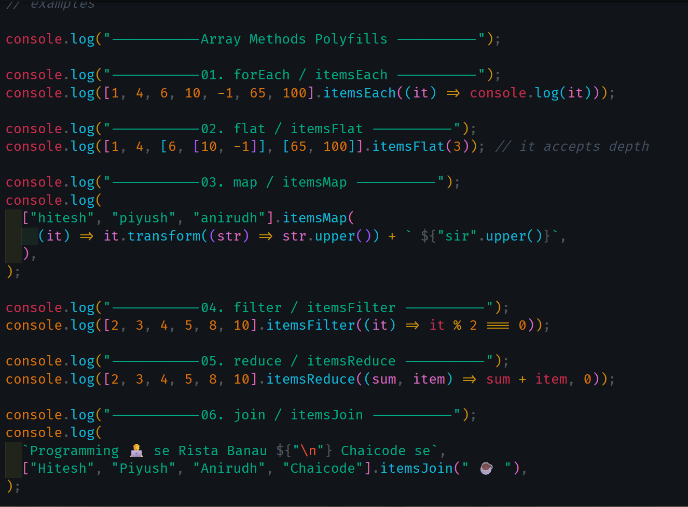

# This is all about polyfills of some array and string methods

polyfill is just build methods which are not available for old browser. To support the modern es6 code we need to write polyfills of some methods like fetch, map, reduce etc. these are modern javascript code which doesnot support in old browser so polyfill need.

in this repo I wrote polyfills of :
- forEach 
- map
- filter
- reduce
- find
- flat
- itemLast : to get last element of array
- join
- transform : to transform case of string
- lastStr : to remove last character of string
- upper : to transform string to uppercase

## output of code 

---
Thanks for reading this.